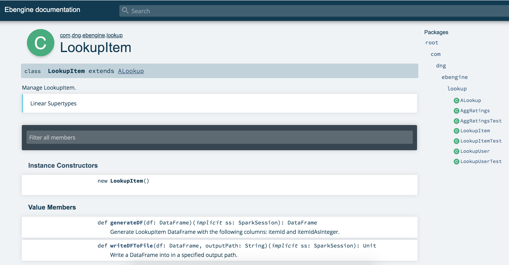

# Ebengine

## Table of contents

1. [Introduction](#introduction)
2. [Tools versions](#tools-versions)
3. [Run the job](#run-the-job)
4. [Documentation](#documentation)
5. [Structure](#structure)

### Introduction
E.B. Engine is a job built on top of *Spark* and *Scala*.

It allows you to generate DataFrames according to certain characteristics, and store them into files.<br />

Also, you might be interested to generate the *Scaladoc* to have more information about the job in general (funcions, parameters...).

Finally, this project also contains some *unit and integration tests*.

### Tools version
|  Tool | Version  |
|---|---|
|  Spark |  2.4.3 |
|  Scala |  2.11 |
|  ScalaTest |  3.0.8  |
|  Maven |  3.4.6     |

For more details, you can take a look to the properties section of the pom.xml :
```
<properties>
	...
	<commons.collections.version>3.2.2</commons.collections.version>
	<scala.version>2.11</scala.version>
	<scalatest.version>3.0.8</scalatest.version>
	<com.typesafe.version>1.2.1</com.typesafe.version>
	
	<spark.core.version>2.4.3</spark.core.version>
	
	<maven.shade.plugin.version>3.2.1</maven.shade.plugin.version>
	<maven.surefire.plugin.version>3.0.0-M3</maven.surefire.plugin.version>
	<scalatest.maven.plugin.version>2.0.0</scalatest.maven.plugin.version>
	<scala.compat.version>2.11.</scala.compat.version>
	<scala.maven.plugin.version>3.4.6</scala.maven.plugin.version>
</properties>
```
### Run the job
First of all, make sure you have [Spark](https://spark.apache.org/docs/latest/index.html) installed.<br />
Then, go in the project root directory
```
$ cd ebengine
```

You can set spark properties in application.conf file (in the root directory), or leave it by default (local mode).<br />
Then you can use [*spark-submit*](https://spark.apache.org/docs/latest/submitting-applications.html) to launch the job.<br />

Feel free to accomodate the configurations according to your needs:<br />
```
$>  ~/Downloads/spark-2.4.3-bin-hadoop2.7/bin/spark-submit \
--class com.dng.ebengine.Main \
--files application.conf \ # Optional because selected by default by Spark
target/ebengine-1.0-SNAPSHOT-with-dependencies.jar
```

### Documentation
There is a documentation of the project generated with ScalaDoc.<br />
If you have [Maven](https://maven.apache.org/plugins/maven-site-plugin/) installed, you can generate it with the command *mvn site*.


### Structure
Below are listed the main directories and files.
- ./ (root directory)
```
- application.conf # Spark configuration
- pom.xml
```

- In src/main
```
- resources/input/ # Contains the input files to the program
- resources/output/ # Will be created when creating files from the Main
- com.dng.ebengine/
   -- lookup/
       -- AggRatings
       -- LookupItem
       -- LookupUser
   -- utils/
      -- EbengineConf # Contains the project constants
```
- In src/test
```
- resources/output/ # Will be created when creating files from the Tests
- com.dng.ebengine/
   -- lookup/ ## Tests of the matching package
       -- AggRatingsTest
       -- LookupItemTest
       -- LookupUserTest
   -- EbengineConf # Contains the project constants
   -- EbengineConfTestUtils # Contains the tests constants
```

